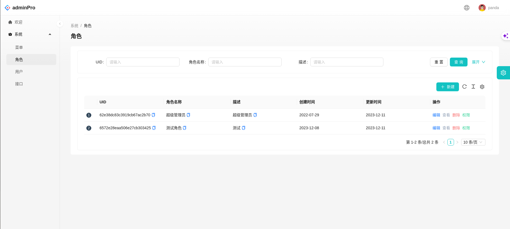
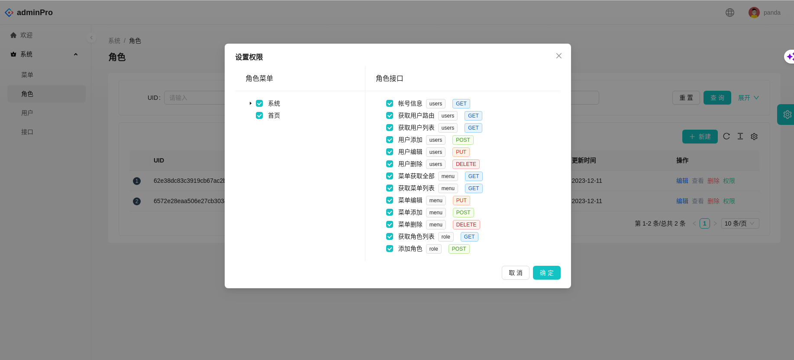
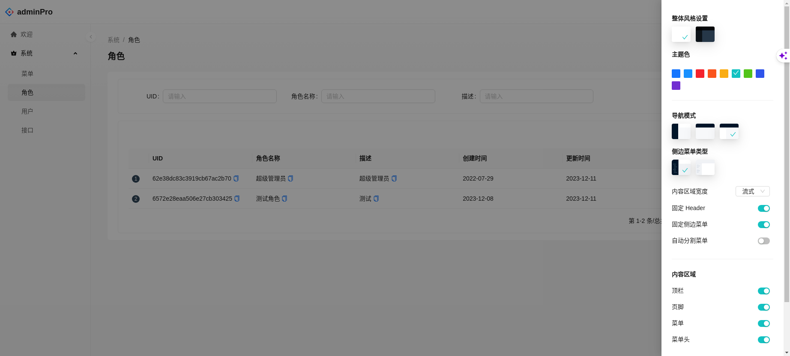

<div align="center"><h1>AdminPro</h1></div>

<div align="center">优秀的企业级管理系统解决方案</div>
<div align="center" style="
    display: flex;
    right: 100px;
    justify-content: center;
    width: 100%;
    height: 100px;
">

[]()
[]()
[](https://ant.design/index-cn)
[]()
[]()
[]()
</div>

简体中文 | [English](./README.md)

## 特征

- 前后端国际化，从源代码中提取翻译字段，按需加载语言包
- 具有权限管理
- 优雅和高度封装 antd ProComponents 设计
- 主题选择
- MongoDB 灵活 高性能 查询能力强的非关系数据库
- FastAPI python 最快的后端框架之一

## 效果








## 项目结构

```
        adminPro
        --|back-py-mongo                # 后端
        --|front                        # 前端
        --|mdsrc                        # md 资源
        --|.env                         # 生产环境变量
        --|.env.dev                     # 测试环境变量
        --|database.yml                 # 数据库部署文件
        --|portainer.yml                # 运维控制系统部署文件
        --|admin.yml                    # AdminPro 部署文件
```
## 部署
- 测试服务器
```shell
docker-compose -f portainer.yml up -d
docker-compose --env-file .env.dev -f database.yml up -d
docker-compose --env-file .env.dev -f admin.yml up -d
# 或者 打包镜像
docker-compose -f portainer.yml build
docker-compose --env-file .env.dev -f database.yml build
docker-compose --env-file .env.dev -f admin.yml build
```
- 生产服务器
```shell
docker-compose -f portainer.yml up -d
docker-compose -f database.yml up -d
docker-compose -f admin.yml up -d
# 或者 打包镜像
docker-compose -f portainer.yml build
docker-compose -f database.yml build
docker-compose -f admin.yml build
```
## 办事列表


- [X] 添加 前端
- [X] 添加 python + mongodb 后端
- [ ] 添加 自动化测试接口
- [X] 添加 部署方式
- [ ] 添加 开发文档