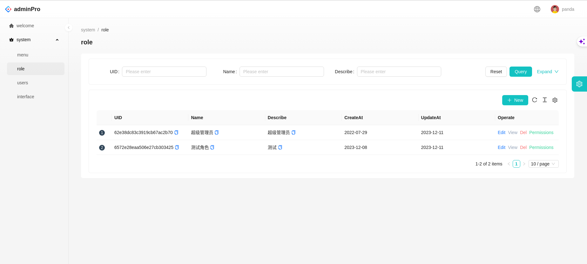
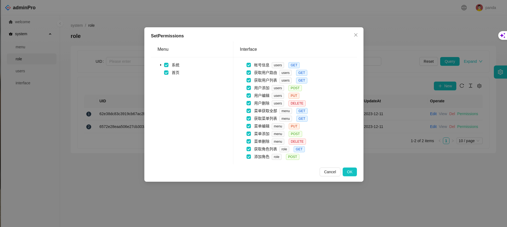

<div align="center"><h1>AdminPro</h1></div>

<div align="center">excellent enterprise-level management system solution</div>
<div align="center" style="
    display: flex;
    right: 100px;
    justify-content: center;
    width: 100%;
    height: 100px;
">

[]()
[]()
[](https://ant.design/index-cn)
[]()
[]()
[]()
</div>

English | [简体中文](./README-zh-CN.md)

## feature

- Front-end and back-end internationalization, extract translation fields from source code, and load language packs on demand
- With permission management
- Elegant and highly encapsulated antd ProComponents design
- theme selection
- MongoDB is a flexible, high-performance, non-relational database with strong query capabilities.
- FastAPI python one of the fastest backend frameworks

## effect





## project structure

```
        adminPro
        --|back-py-mongo                # back
        --|front                        # front
        --|mdsrc                        # md resource
        --|.env                         # Production environment variables
        --|.env.dev                     # Test environment variables
        --|database.yml                 # Database deployment file
        --|portainer.yml                # Operation and maintenance control system deployment files
        --|admin.yml                    # AdminPro deployment files
```
## deploy
- test server
```shell
docker-compose -f portainer.yml up -d
docker-compose --env-file .env.dev -f database.yml up -d
docker-compose --env-file .env.dev -f admin.yml up -d
# Or package image
docker-compose -f portainer.yml build
docker-compose --env-file .env.dev -f database.yml build
docker-compose --env-file .env.dev -f admin.yml build
```
- production server
```shell
docker-compose -f portainer.yml up -d
docker-compose -f database.yml up -d
docker-compose -f admin.yml up -d
# Or package image
docker-compose -f portainer.yml build
docker-compose -f database.yml build
docker-compose -f admin.yml build
```
## To do list


- [X] add front
- [X] add python + mongodb back
- [ ] add automated testing interface
- [X] add deployment method
- [ ] add development documentation